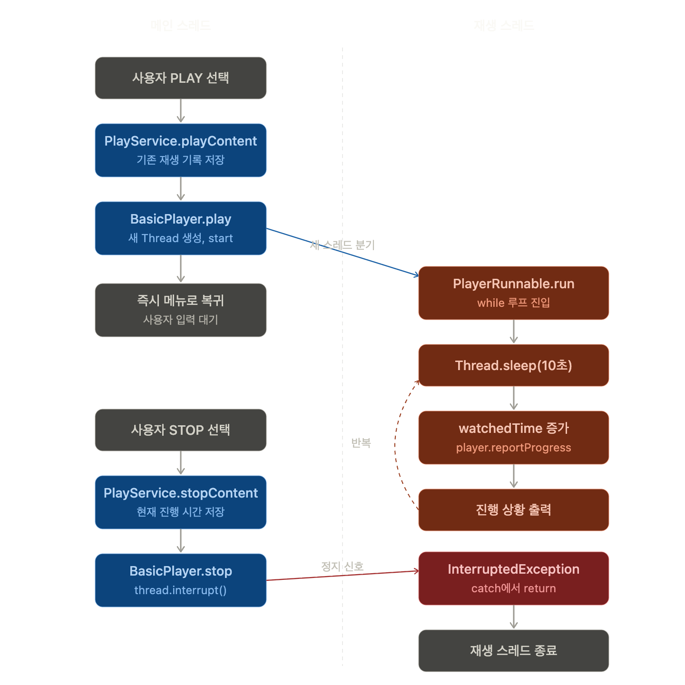

# 회고
기존 넷플릭스 모티브 cli 프로그램의 기능들 중 비동기로 처리할만한 기능이 없어보여 재생/정지 기능을 활용해 비동기 프로그래밍을 구현했습니다.
아래 그림은 플로우차트입니다.

이전 과제 내용이었던 컨텐츠 조회 및 추가는 동기 프로그램을 유지하되, 재생을 별도의 플레이어를 통해 재생한다는 상황을 가정했고, 유튜브의 PIP기능을 모티브로 구현했습니다.

## 설계하면서 고민했던 것들 (도메인 + 설계)
1. 재생 상태는 어떻게 관리할 것인가?
    - 한 컨텐츠에 대해 <재생 → 정지 → 재생> 시 처음부터 재생하는 것이 아닌 이어 보기
2. 재생기라는 클래스 활용?
    - interface로 stop/play 명세 후 재생기 구현 클래스가 현재 재생 중인 컨텐츠 관리
3. 유저가 재생한 컨텐츠 관리
    - 이전에 봤던 컨텐츠 재생 정보를 기록하고, 나중에 다시 재생시 봤던 곳부터 다시 재생
4. 스레드로 별도 재생
    - console에서 실시간으로 어떻게 보여줄까?
    - 재생은 재생대로, 다른 작업은 할수 있게 (PIP 모드에서 영감)
5. 재생기는 오직 1개만 존재
    - 여러 재생기를 돌려 여러 컨텐츠를 재생하는건 도메인 규칙 위배

## 질문
1. 현재 구조에서 교육시간에 배웠던 ExecutorService는 도입하지 않았습니다. 스레드풀 기반의 스레드 관리 및 실행 주체인데, 현재 제 프로젝트에서 스레드 풀 개념 도입은 과하다고 판단하여, Runnable로만 재생/정지 구현 후 Thread가 작업에 대한 실행주체로 설정했습니다. 이 근거가 적절한지 묻고 싶습니다.
2. 제가 이전 동기 프로그래밍에서 구현한 기능들에 대해선 비동기로 구현하지 않았습니다. Kevin이 보시기에 기존에 명세됐던 기능들 중 비동기로 처리할만한 기능이 있나요?
3. 현재 BasicPlayer의 멤버변수로 Thread를 가지는데, 